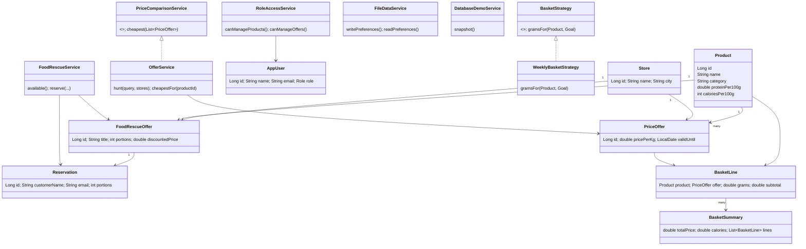

# FoodWise — diagramă de clase

```mermaid
classDiagram
    class Product {
      Long id
      String name
      String category
      double proteinPer100g
      int caloriesPer100g
    }
    class Store { Long id; String name; String city }
    class PriceOffer { Long id; double pricePerKg; LocalDate validUntil }
    class FoodRescueOffer { Long id; String title; int portions; double discountedPrice }
    class Reservation { Long id; String customerName; String email; int portions }
    class AppUser { Long id; String name; String email; Role role }
    class BasketLine { Product product; PriceOffer offer; double grams; double subtotal }
    class BasketSummary { double totalPrice; double calories; List~BasketLine~ lines }
    class BasketStrategy { <<interface>>; gramsFor(Product, Goal) }
    class WeeklyBasketStrategy { gramsFor(Product, Goal) }
    class PriceComparisonService { <<interface>>; cheapest(List~PriceOffer~) }
    class OfferService { hunt(query, stores); cheapestFor(productId) }
    class FoodRescueService { available(); reserve(...) }
    class FileDataService { writePreferences(); readPreferences() }
    class DatabaseDemoService { snapshot() }
    class RoleAccessService { canManageProducts(); canManageOffers() }

    Product "1" --> "many" PriceOffer
    Store "1" --> "many" PriceOffer
    Store "1" --> "many" FoodRescueOffer
    Product "1" --> "many" FoodRescueOffer
    FoodRescueOffer "1" --> "many" Reservation
    Product --> BasketLine
    PriceOffer --> BasketLine
    BasketLine "many" --> BasketSummary
    BasketStrategy <|.. WeeklyBasketStrategy
    PriceComparisonService <|.. OfferService
    OfferService --> PriceOffer
    FoodRescueService --> FoodRescueOffer
    FoodRescueService --> Reservation
    RoleAccessService --> AppUser
```

The application has two interface implementations used by the application services and multiple collections: `List`, `Set` and `Map`.
